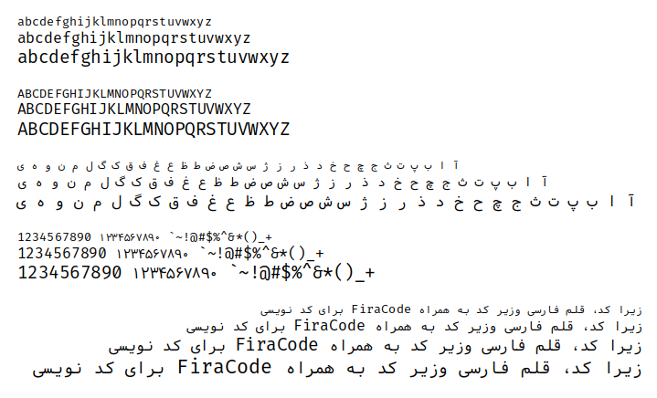
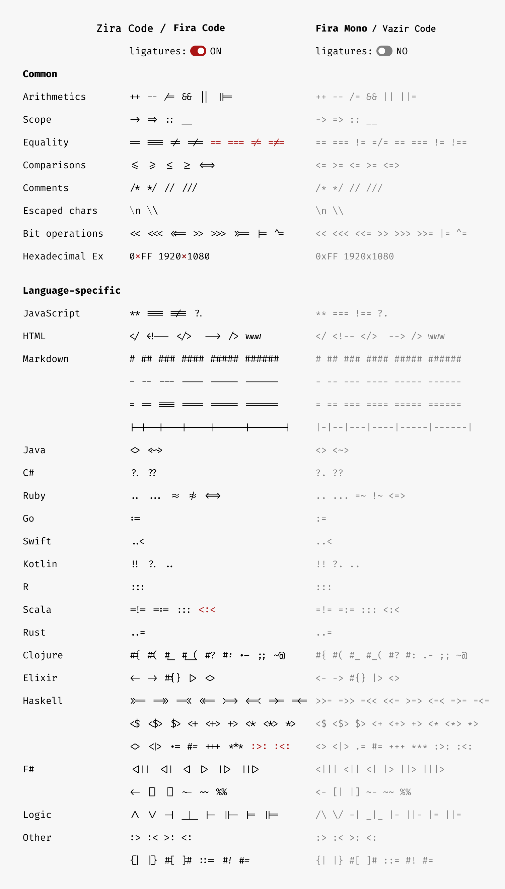

## Zira Code: free monospaced font with programming ligatures(FiraCode) + Persian Characters(VazirCode)

- [FiraCode](https://github.com/tonsky/FiraCode/)
- [VazirCode](https://github.com/rastikerdar/vazir-code-font/)

***

### install

#### GNU/Linux
gnu/linux users could use [kateb](https://github.com/kiamazi/kateb) font manager, to install vazir-code font.

```
kateb install ziracode
or
kateb update ziracode
```

***





